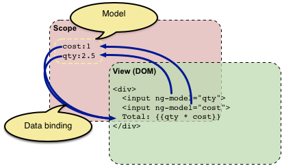

AngularJS 예제 설명
===================

First Example: Data Binding
---------------------------
이 예제는 어떤 상품에 대한 개수와 가격을 곱해서 총 가격을 출력하는 예제이다. 이것을 통해서 Data Binding이 어떻게 되는지 알아볼 것이다.   
~~~
// first_example.html
...

...
~~~

먼저 head tag안에서 script tag로 AngularJS를 부른다. 이걸 안 하면 시작이 안 된다.

~~~
// first_example.html
...

	<b>Invoice:</b>
	

		Quantity: <input type="number" min="0" ng-model="qty">
	

	

		Costs: <input type="number" min="0" ng-model="cost">
	

	

		<b>Total:</b> {{qty * cost | currency}}
	

...
~~~
봐보면 HTML형식이지만 안에 처음보는 Markup들이 몇 개 있을 것이다. AngularJS에서는 이것들을 'Template'라고 부른다. AngularJS가 사용자가 만든 Application을 시작할 때에, AngularJS의 컴파일러를 통해서 이 Template들을 새로운 Markup으로 사용한다. 그러면 컴파일러를 통해서 새로 렌더링이 된 DOM이 생긴다. 이 DOM을 View라고 부른다.  

처음 보이는 새로운 markup은 Directive라는 것이다. 이것은 HTML의 어떤 attribute나 element에 어떤 특징을 지정하는 것이다. 위의 코드에선 `ng-app`라는 attribute를 사용하고 있는데, 이 directive를 통해서 새로운 application을 만든다.   
AngularJS에는 attribute 뿐만이 아니라 어떤 특정 element에 대한 directive도 있는데, 위에서는 `input` element에서 몇가지 새로운 directive를 넣었다. `ng-model`은 특정 입력의 field값을 변수에 저장/update하는 것이다. `min`은 입력의 최소값을 정하는 것으로, 이 최소값보다 작은 값이 들어오면 변수 안에 안 들어간다.   
  
두번째 새로운 markup은 `{{ expression | filter }}`이다. AngularJS의 컴파일러가 이것을 봤을 때에, 지정한 model의 값을 받아서 출력한다. 여기서 `expression`는 AngularJS가 변수에 읽고 쓸 수 있게 해놓은 곳이다. 이 변수들은 전역변수가 아닌, 원래 JavaScript의 Local Variable같이 특정 'Scope'안에서만 있는 변수이다. AngularJS는 변수들이 `expression`에 접근을 할 수 있도록 Scope를 만들어준다. 특정 Scope의 변수에 저장된 값들은 'Model'로 지정이 되는데, 위의 예제에선 Quantity의 값이 'qty'라는 model로, Costs의 값이 'cost'의 model에 들어간다. 그리고 이 model들이 한 Scope안에 있는 것이다.   
  
위의 예제엔 그 외에도 `filter`라는 것이 존재한다. `filter`는 `expression`이 특정의 형식으로 사용자에게 출력이 되도록 하는 역할이다. 위의 예제에선 달러로 보이도록 `currency`가 지정되어있다.  
  
이 예제에서 가장 중요한 점은 입력한 값들이 **live binding**이 된다는 것이다. 입력이 바뀌는 순간 `expression`으로 나오는 출력이 다시 계산되고 DOM이 그 값으로 바뀌어서 출력이 바뀌는 것이다. 이런 컨셉을 Two-way data binding (쌍방향 데이터 바인딩)이라고 한다.

Second Example: Adding UI logic (Controllers)
---------------------------------------------
두번째로 위의 예제를 사용해서 가격을 여러 나라의 가격 단위로 표현되도록 해보자.  

~~~
// invoice1.js
(function(angular) {
	'use strict';
	angular.module('invoice1', []).controller('InvoiceController', function InvoiceController(){
		this.qty = 1;
		this.cost = 2;
		this.inCurr = 'EUR';
		this.currencies = ['USD', 'EUR', 'CNY'];
		this.usdToForeignRates = {
			USD: 1,
			EUR: 0.74,
			CNY: 6.09
		};

		this.total = function total(outCurr){
			return this.convertCurrency(this.qty * this.cost, this.inCurr, outCurr);
		};

		this.convertCurrency = function convertCurrency(amount, inCurr, outCurr) {
			return amount * this.usdToForeignRates[outCurr] / this.usdToForeignRates[inCurr];
		};

		this.pay = function pay(){
			window.alert('Thanks!');
		};
	});
})(window.angular);
~~~

~~~
// second_example.html
...

...

	<b>Invoice:</b>
	

		Quantity: <input type="number" min="0" ng-model="invoice.qty" required>
	

	

		Costs: <input type="number" min="0" ng-model="invoice.cost" required>
		<select ng-model="invoice.inCurr">
			<option ng-repeat="c in invoice.currencies">{{c}}</option>
		</select>
	

	

		<b>Total:</b>
		 {{invoice.total(c) | currency:c}} 
		<button class="btn" ng-click="invoice.pay()">Pay</button>
	

...
~~~

뭔가 첫번째 예제와 너무 많이 달라진 것 같지만, 천천히 봐보면 다 이해할 수 있다.  
  
먼저, 'invoice.js'라는 새로운 JavaScript파일이 있다. 이 파일안에는 **Controller**를 가지고 있다. 더 정확하게 얘기하자면, 이 파일에 실제 Controller Interface에서 사용될 constructor 함수가 지정되어있다. Controller는 변수와 expression과 directive들에 대한 기능을 위한 것이다.   
  
다음으로 HTML파일에 `ng-controller`라는 새로운 directive를 더했다. 이것은 AngularJS에게 `InvoiceController`라는 새로운 Controller가 앞으로 나오는 directive를 가지고 있는 element들과 그 자식 element들을 책임진다는 것을 알려준다. `InvoiceController as invoice`는 AngularJS에게 현재 Scope에서 `InvoiceController`라는 Controller를 `invoice`라는 변수로 저장하라는 뜻이다. 그래서 앞으로 컨트롤러를 부를 때에 컨트롤러명을 전부다 사용하는 것이 아니라 변수면 `invoice`만 사용하면 부를 수 있다. 참고로 새로 더해진 `required`라는 directive는 이 값이 없으면 expression을 아예 하지 않는다는 뜻이다.   
  
그 외에도 HTML파일의 모든 expression들이 Controller의 변수를 사용하도록 `ng-model`의 값들 앞에 `invoice.`을 붙였다. 그리고 US$뿐만이 아니라 다른 통화로도 가격이 출력이 되도록 Controller에 지정되어있는 모든 통화로 출력이 되도록 `ng-repeat` Template를 사용했다. 또 Controller에 지정되어 있는 `total()`함수를 사용하기 위해서 총 가격을 출력할 때에 expression에 `{{invoice.total(...)}}`를 사용해서 결과가 DOM에도 binding되도록 했다.    
  
여기에서도 binding은 live binding이다. 하지만 live binding와 다르게 'Pay'라는 버튼을 클릭하면 `pay()`함수가 작동이 되도록 `ng-click`이라는 새로운 directive를 추가했다. 새로운 JavaScript파일에는 controller를 등록하기 위한 **Module**을 만들기도 했는데, 이건 다음 예제에서 확인해 본다. 위의 파일들은 아래와 같이 작동된다.  
  

Third Example: View-independent business logic: Services
----------------------------------------------------------
현재 `InvoiceController`가 우리의 예제의 모든 Logic을 가지고 있는데, 여기서 몇 가지 Logic들을 Controller에서 빼서 Service에 넣음으로 다른 application에서도 사용할 수 있도록 하자.
  
  
~~~
// finance2.js
(function(angular) {
	'use strict';
	angular.module('finance2', []).factory('currencyConverter', function() {
		var currencies = ['USD', 'EUR', 'CNY'];
		var usdToForeignRates = {
			USD: 1,
			EUR: 0.74,
			CNY: 6.09
		};

		var convert = function(amount, inCurr, outCurr){
			return amount * usdToForeignRates[outCurr] / usdToForeignRates[inCurr];
		};

		return {
			currencies: currencies,
			convert: convert
		};
	});
})(window.angular);
~~~

~~~
// invoice2.js
...

angular.module('invoice2', ['finance2']).controller('InvoiceController', ['currencyConverter', function InvoiceController(currencyConverter){
	this.qty = 1;
	this.cost = 2;
	this.inCurr = 'EUR';
	this.currencies = currencyConverter.currencies;

	this.total = function total(outCurr){
		return currencyConverter.convert(this.qty * this.cost, this.inCurr, outCurr);
	};

	this.pay = function pay(){
		window.alert('Thanks!');
	};
}]);

...

~~~

~~~
// third_example.html
...

...

...
~~~

지난번보단 변화가 적은 것 같다. 말그대로 원래 'invoice1.js'에 있던 것들을 'finance2.js'로 옮겼을 뿐이기 때문이다. 더 자세하게 봐보자.  
먼저 'invoice1.js'에 있던 `convertCurrency`함수에 대한 것들과 `currencies`, 그리고 `usdToForeignRates`가 'finance2.js'로 옮겨졌다. 그러면 어떻게 이 옮겨진 함수와 변수들을 한 곳에서 사용하는가? 여기서 **Dependency Injection**(DI)라는 개념이 사용된다. DI란 object와 함수들이 만들어지는 방법과 그것들이 갖는 dependencies를 지정해주는 Software Design Pattern이다. AngularJS의 모든 것(directive, filter, controller, service...)들은 이 DI로 인해 만들어지고 연결된다. 이런 DI를 가지고 있는 것을 **injector** 라고 부른다.  
  
DI를 사용하기 위해선 모든 것들이 같이 사용되고 등록되는 장소가 필요하다. AngularJS에서는 이것을 위해서 **module**을 사용한다. AngularJS가 시작할 때에, `ng-app` directive로 지정된 module의 설정과 그 module이 depend하는 모든 module을 사용한다. 위의 예제에서는 `ng-app="invoice2"`로 인해서 AngularJS에게 `invoice2` module을 이 application의 main module로 사용하라고 지시한다. 'invoice2.js'의 `angular.module('invoice2', ['finance2'...`가 `invoice2` module이 `finance1`라는 모듈에 depend한다는 것을 알려준다. 이것으로 AngularJS는 `InvoiceController`와 `currencyConverter`라는 service도 함께 쓰게 되는 것이다.  
  
이제 AngularJS가 application의 모든 파트를 알기 때문에, 만들기만 하면 된다. 두번째 예제를 통해서 우리는 Controller가 Constructor function으로 만들어지는 것을 확인할 수 있었는데, service는 만드는 방법이 다양하다. 위의 예제에서는 어떤 이름 없는 함수(anonymous함수)를 `currencyConverter` service를 위한 factory함수로 사용한다. 이 함수는 `currencyConverter` service를 instance로 반환한다. (Service는 Module로 Service의 이름과 Service의 factory function을 지정함으로 만들 수 있다.) 
  
그렇다면 어떻게 `InvoiceController`가 `currencyConverter`함수를 사용할 수 있나? AngularJS에서는 단순하게 construction function에서 argument로 줘서 사용할 수 있다. 위의 예제에서는 `function InvoiceController(...){...}`에 `currencyConverter`라는 argument가 있는데, 이것으로 AngularJS는 controller와 service사이의 dependency를 이해하고, controller를 부를 때에 service의 instance를 argument로 부른다.  
  
마지막 차이는 `angular.module(..).controller`가 단순한 하나의 함수를 보내는 것이 아닌 Array형식으로 보낸다는 점이다. 두번째 예제에서는 단순히 `function InvoiceController(){...}`를 보냈는데, 이번 예제에서는 `['currencyConverter', function InvoiceController(...){...}]`으로 보내진 것이다. 이 Array를 봐보면 제일 먼저 Controller가 필요한 Service Dependency의 이름이 들어가고, 제일 마지막에 Controller의 constructor함수가 들어간다. AngularJS는 이 Array형식을 사용해서 DI가 작동되도록 한다. 

